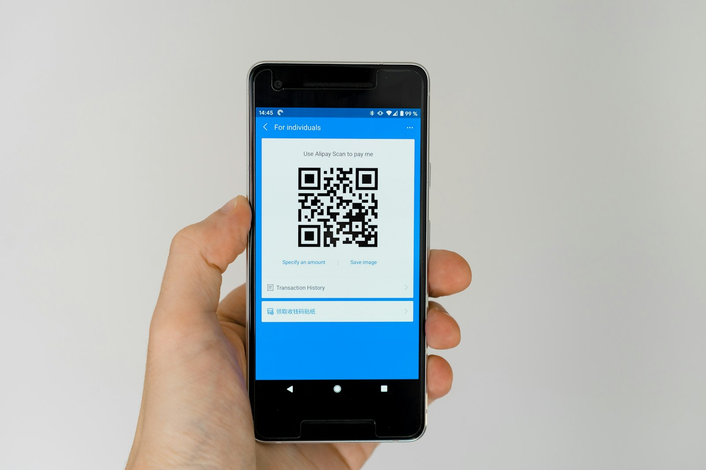

# Arquitectura de Pagos con Stablecoins: Consideraciones Técnicas

> Parte de la serie [Stablecoins y Pagos C2B - Visión General](../Overview-ES.md) | [English](../en/stablecoin-payment-architecture.md) | [中文](../zh/stablecoin-payment-architecture.md)

## Introducción

La implementación de pagos con stablecoins en flujos de consumidor a negocio (C2B) requiere navegar tanto la tecnología blockchain como la infraestructura financiera práctica. Este artículo examina las decisiones arquitectónicas clave, componentes técnicos y consideraciones de implementación que las empresas deben abordar al integrar pagos con stablecoins.

Comprender estos fundamentos técnicos es esencial para construir sistemas de pago con stablecoins robustos, escalables y conformes.


*Arquitectura técnica de los sistemas modernos de pagos con stablecoins*

---

## 1. Diseño de Stablecoins y Contratos Inteligentes

### Arquitectura Colateralizada en Fiat

Las stablecoins dominantes hoy en día (USDT, USDC, PYUSD, etc.) utilizan un modelo **colateralizado en fiat**:

**Principios de Diseño:**
- Cada token está respaldado por reservas equivalentes de activos fiat
- Reservas mantenidas por el emisor (típicamente efectivo o bonos del Tesoro de EE.UU. a corto plazo)
- Garantía de redención 1:1
- Auditorías/atestaciones regulares de terceros
- Reportes transparentes de composición de reservas[^1]

**Funciones de Contrato Inteligente:**

Funcionalidad básica ERC-20/equivalente:
```solidity
// Funciones principales
mint(address to, uint256 amount)      // El emisor crea nuevos tokens
burn(address from, uint256 amount)    // El emisor destruye tokens
transfer(address to, uint256 amount)  // El usuario envía tokens
```

**Características de Cumplimiento Normativo:**
```solidity
// Funciones de cumplimiento
freeze(address account)               // El emisor congela la cuenta
unfreeze(address account)             // El emisor descongela la cuenta
blacklist(address account)            // Bloquear permanentemente la cuenta
```

Estas características de cumplimiento permiten a los emisores responder a:
- Solicitudes de las fuerzas del orden
- Resultados de screening de sanciones
- Detección de actividades ilícitas
- Órdenes regulatorias

### Diseños Alternativos (Contexto Histórico)

**Colateralizadas en Cripto:**
- Respaldadas por otras criptomonedas (por ejemplo, DAI respaldado por ETH)
- Sobre-colateralizadas para absorber volatilidad
- Descentralizadas pero ineficientes en capital
- Adopción limitada para pagos debido a la complejidad

**Algorítmicas:**
- Sin colateral; depende de mecanismos de oferta/demanda
- Fallas de alto perfil (colapso de Terra/UST 2022)
- Escepticismo regulatorio
- Generalmente evitadas para aplicaciones de pago[^2][^3]

**Consenso de la Industria:**
Para stablecoins enfocadas en pagos, **modelos completamente reservados y auditados de forma transparente** se han convertido en el estándar para estabilidad y confianza.

---

## 2. Capas de Liquidación y Escalabilidad

### Desafíos Tradicionales de Blockchain

**El despliegue temprano de stablecoins en cadenas de propósito general enfrentó limitaciones:**

**Ethereum:**
- **Ventajas**: Más descentralizada, segura, establecida
- **Desafíos**: Tarifas más altas ($1-50 por transacción durante congestión), confirmación más lenta (12-15 segundos por bloque, 5-10 minutos para confianza)

**Tron:**
- **Ventajas**: Más rápido (bloques de 3 segundos), más barato (tarifas de $0.01-0.10)
- **Desafíos**: Más centralizada, menos herramientas de desarrollo
- **Realidad**: Domina las transferencias minoristas de USDT en Asia debido a los bajos costos

### Redes de Pago de Propósito Específico (2024-2025)

Surgieron redes especializadas de alto rendimiento optimizadas para pagos:

**Circle Arc:**
- USDC como moneda nativa de gas
- Finalidad determinística subsegundo
- Motor FX incorporado para múltiples monedas
- Confiabilidad de grado empresarial[^4][^5]

**Stripe/Paradigm Tempo:**
- Soporte de gas multi-stablecoin (USDC, USDT)
- Finalidad subsegundo
- Primitivas específicas para pagos
- Alto rendimiento a escala de comercio electrónico[^6][^7]

**Tether Stable/Plasma:**
- Plasma: Transferencias USDT sin tarifas
- Stable: Liquidación principal con consenso StableBFT
- Pago de tarifas basado en USDT
- Arquitectura optimizada para minoristas[^8]

**Comparación de Rendimiento:**

| Red | Finalidad | Rendimiento | Moneda de Gas | Costo por Tx |
|---------|----------|------------|--------------|-------------|
| Ethereum | 12-15 seg | ~15 TPS | ETH | $1-50 |
| Tron | 3 seg | ~2,000 TPS | TRX | $0.01-0.10 |
| Arc | <1 seg | ~10,000 TPS | USDC | <$0.01 |
| Tempo | <1 seg | ~10,000 TPS | USDC/USDT | <$0.01 |
| Stable/Plasma | <1 seg | ~10,000 TPS | USDT | $0 - $0.001 |

### Soluciones de Escalado Capa-2

**Enfoque alternativo:** Construir sobre Ethereum pero usar Capa-2 para escalabilidad

**Ejemplos:**
- **Coinbase Base**: Rollup optimista, transacciones USDC de bajo costo
- **Polygon**: Sidechain, alto rendimiento, compatible con EVM
- **Arbitrum/Optimism**: Rollups optimistas con seguridad de Ethereum

**Ventajas:**
- Hereda la seguridad de Ethereum
- Tarifas mucho más bajas (<$0.01 típicamente)
- Confirmación más rápida
- Compatibilidad con herramientas existentes

**Compensaciones:**
- Complejidad adicional (puentes entre capas)
- Retrasos de retiro (rollups optimistas tienen período de desafío de 7 días)
- Menos maduras que las opciones de Capa-1

### Estrategia Multi-Cadena

Muchas stablecoins se emiten en múltiples cadenas:

**Despliegues de USDC:**
- Ethereum
- Solana
- Polygon
- Avalanche
- Arbitrum
- Base
- ...y más

**Decisión del Comerciante:**
Soportar las redes más utilizadas por los clientes objetivo. Por ejemplo:
- **EE.UU./Europa**: Ethereum, Base, Polygon
- **Asia minorista**: Tron (para USDT)
- **Usuarios DeFi**: Ethereum, Solana
- **Sensibles al costo**: Capa-2s, Tron, cadenas de pago dedicadas

---

## 3. Tarifas de Gas y Experiencia de Usuario

### El Problema del Token de Gas

Fricción tradicional de UX blockchain:
1. El usuario quiere pagar al comerciante 10 USDC
2. El usuario necesita USDC (para el pago) + ETH (para tarifas de gas)
3. El usuario debe adquirir dos tokens diferentes
4. Las tarifas de gas fluctúan impredeciblemente
5. Complejo para usuarios no nativos de cripto

**Resultado:** Mala experiencia de usuario que disuade la adopción masiva.

### Soluciones: Abstracción de Gas

**Enfoque 1: Stablecoin-como-Gas**

Las nuevas blockchains orientadas a pagos utilizan stablecoins mismas como gas:

**Tempo:** Acepta USDC/USDT para tarifas nativamente[^9]
- El usuario solo necesita USDC
- Tarifas denominadas en dólares familiares
- Sin exposición a tokens volátiles

**Arc:** Usa USDC para gas[^10]
- Presupuesto de tarifas predecible
- Token único para pagos y tarifas
- Contabilidad simplificada

**Stable/Plasma:** Usan USDT para tarifas[^11]
- Variantes de USDT (gasUSDT) para pago de tarifas
- Opciones sin tarifas para transferencias estándar
- Economía amigable para minoristas

**Enfoque 2: Paymaster / Abstracción de Cuenta**

**Abstracción de Cuenta EIP-4337:**[^12]
- Carteras de contrato inteligente en lugar de EOAs (Cuentas de Propiedad Externa)
- Contratos **Paymaster** patrocinan tarifas de gas en nombre de los usuarios
- El usuario firma la transacción, el paymaster paga el gas
- Las tarifas de gas pueden deducirse del saldo de stablecoin

**Implementación:**
```solidity
// Concepto simplificado de paymaster
contract Paymaster {
    function validatePaymasterUserOp(UserOperation calldata userOp)
        external returns (bytes memory context) {
        // El comerciante o plataforma patrocina el gas
        // El saldo USDC del usuario se debita el monto equivalente
    }
}
```

**Beneficios:**
- Los usuarios transactan solo con stablecoins
- Los comerciantes o plataformas subsidian el gas
- Modelos de tarifas flexibles (gratis, con descuento, etc.)
- Experiencia de incorporación mejorada

**Ejemplo: Tether Stable**

Usa esquema EIP-4337/EIP-7702 donde:
- La cartera del usuario actúa temporalmente como contrato inteligente
- El paymaster designado paga el gas en USDT en nombre del usuario
- El usuario solo ve disminuir el saldo de stablecoin
- Tras bambalinas, patrocinio de gas sofisticado[^13]

---

## 4. Custodia e Infraestructura de Carteras

### Modelos Custodiales vs. No Custodiales

**Custodial (Carteras Alojadas):**

**Cómo Funciona:**
- El proveedor de servicios mantiene las claves privadas
- Los saldos de usuarios se rastrean en base de datos interna
- Las transferencias entre usuarios ocurren fuera de la cadena (instantáneas)
- Se liquidan periódicamente en cadena en lotes

**Ejemplos:**
- PayPal PYUSD dentro de la aplicación PayPal
- Saldos de cuenta Circle
- Carteras de intercambio (Coinbase, Kraken)

**Ventajas:**
- Transferencias instantáneas entre usuarios en la misma plataforma
- UX familiar (como aplicación bancaria)
- Recuperación de cuenta si el usuario pierde la contraseña
- Sin tarifas de gas para transferencias internas
- Cumplimiento simplificado (el proveedor lo maneja)

**Compensaciones:**
- El usuario no controla las claves privadas
- Riesgo de contraparte (confiar en el proveedor)
- Centralización (anula algunos beneficios de cripto)

**No Custodial (Carteras de Auto-Custodia):**

**Cómo Funciona:**
- El usuario controla las claves privadas
- Todas las transacciones ocurren en cadena
- El software de cartera ayuda a administrar las claves
- El usuario es responsable de la seguridad

**Ejemplos:**
- MetaMask
- Cartera de hardware Ledger
- Trust Wallet
- Rainbow

**Ventajas:**
- Propiedad verdadera (no tus claves, no tus monedas)
- Sin riesgo de contraparte
- Resistente a la censura
- Interoperable entre servicios

**Compensaciones:**
- El usuario es responsable de la seguridad de las claves
- Claves perdidas = fondos perdidos (sin recuperación)
- Cada transacción incurre en tarifas de gas
- UX más compleja

### Arquitecturas de Pago Híbridas

**Los sistemas de pago modernos soportan ambos:**

**Pagos Cripto de Stripe:**
1. El cliente paga desde cartera de auto-custodia (en cadena)
2. Stripe detecta el pago en cadena
3. Stripe acredita inmediatamente al comerciante (libro mayor interno)
4. Stripe agrupa liquidaciones periódicamente
5. El comerciante recibe fiat o stablecoin según preferencia

**Beneficios:**
- Los usuarios pueden pagar desde cualquier cartera
- Los comerciantes reciben crédito instantáneo
- Lo mejor de ambos mundos

### Soluciones de Custodia para Comerciantes

**Opciones para empresas que reciben stablecoins:**

**1. Auto-Custodia con Multisig**
- Usar cartera multi-firma (requiere 2 de 3 o 3 de 5 firmas)
- Módulos de seguridad de hardware (HSMs) para almacenamiento de claves
- Mejor para empresas que desean control total

**2. Custodio Calificado**
- Custodio regulado (Coinbase Custody, Anchorage, BitGo)
- Cuentas segregadas
- Cobertura de seguro
- Seguridad profesional
- Soporte de cumplimiento

**3. Auto-Conversión de Procesador de Pagos**
- Aceptar stablecoin, convertir inmediatamente a fiat
- Nunca mantener cripto (evitar riesgo de volatilidad)
- El procesador maneja todas las operaciones cripto
- Liquidación bancaria familiar

**4. Cuenta Circle / Saldo Custodial**
- Mantener USDC en cuenta Circle
- Ganar intereses sobre saldos
- Transferencias instantáneas a otros usuarios Circle
- Redención directa por USD
- Integración API para gestión de tesorería

**Consideraciones de Seguridad:**
- **Carteras calientes**: En línea, para necesidades operativas (mayor riesgo)
- **Carteras frías**: Fuera de línea, para almacenamiento a largo plazo (menor riesgo)
- **Multi-firma**: Sin punto único de falla
- **Seguro**: Seguro contra crímenes para tenencias cripto
- **Registros de auditoría**: Registro exhaustivo para reconciliación

---

## 5. Integración con Sistemas Existentes

### Integración de Plataforma de Comercio Electrónico

**Objetivo:** Aceptar stablecoins tan fácilmente como tarjetas de crédito.

**Patrón de Arquitectura:**

```
┌─────────────┐
│   Cliente   │
└──────┬──────┘
       │ Paga con USDC
       v
┌────────────────────┐
│ Pasarela de Pago   │  (Coinbase Commerce, Stripe, BitPay)
│ - Detecta pago     │
│ - Valida monto     │
│ - Maneja cripto    │
└─────────┬──────────┘
          │ Webhook: payment_confirmed
          v
┌───────────────────────┐
│ Plataforma E-commerce │  (Shopify, WooCommerce, Personalizado)
│ - Marcar pedido pagado│
│ - Activar cumplimiento│
│ - Generar factura     │
└───────────────────────┘
```

**Puntos de Integración:**

**1. Widget de Checkout**
```html
<!-- Ejemplo: checkout cripto de Stripe -->
<script src="https://js.stripe.com/v3/"></script>
<div id="crypto-payment-element"></div>
<script>
  stripe.createPaymentElement({
    paymentMethods: ['crypto'],
    currency: 'usd',
    amount: 5000 // $50.00
  });
</script>
```

**2. Manejo de Webhook**
```javascript
// Recibir confirmación de pago
app.post('/webhooks/crypto-payment', (req, res) => {
  const event = req.body;

  if (event.type === 'payment.confirmed') {
    const orderId = event.metadata.order_id;
    const amount = event.amount; // en stablecoin
    const txHash = event.transaction_hash;

    // Marcar pedido como pagado
    updateOrderStatus(orderId, 'paid', {
      amount, txHash, paymentMethod: 'USDC'
    });

    // Activar cumplimiento
    fulfillOrder(orderId);
  }

  res.sendStatus(200);
});
```

**3. Reconciliación**
- Reportes de reconciliación diaria del procesador de pagos
- Emparejar transacciones blockchain con pedidos internos
- Integración contable (QuickBooks, Xero, etc.)

### Integración de Punto de Venta (POS)

**Comercio minorista físico que acepta stablecoins:**

**Flujo:**
1. El cliente completa la compra
2. El cajero ingresa el monto en el POS
3. El POS genera código QR (solicitud de pago)
4. El cliente escanea con aplicación de cartera
5. El cliente confirma el pago
6. El POS detecta el pago en cadena (o vía procesador de pagos)
7. Se imprime el recibo

**Tecnología:**
- Solicitudes de pago con código QR (estándar BIP-21)
- NFC para pagos sin contacto (emergente)
- Integración de Lightning Network para pagos instantáneos de Bitcoin
- Terminales POS específicas para stablecoins

**Proveedores:**
- BitPay POS
- Flexa (red Spedn)
- Crypto.com Pay
- Integraciones personalizadas

### Integración Bancaria y de Tesorería

**Conectar operaciones de stablecoin con banca tradicional:**

**On-Ramp / Off-Ramp:**
- **On-ramp**: Convertir fiat → stablecoin
- **Off-ramp**: Convertir stablecoin → fiat

**Métodos:**

**1. Redención Directa del Emisor**
- Circle: Redimir USDC 1:1 por USD (requiere Cuenta Circle)
- Paxos: Redimir PYUSD/USDP 1:1 por USD
- Montos mínimos típicamente $100k-$1M
- Liquidación en 1-2 días hábiles

**2. Servicios de Intercambio**
- Coinbase, Kraken, Gemini: Liquidez instantánea
- Tasas competitivas
- Mínimos más bajos ($100+)
- Conversión instantánea stablecoin ↔ fiat
- Retiro por transferencia bancaria o ACH

**3. Mesas OTC**
- Para montos grandes ($1M+)
- Tasas negociadas
- Términos de liquidación personalizados
- Basado en relaciones

**Gestión de Tesorería:**

**Estrategias Automatizadas:**
```
Ingresos Diarios en USDC
      ├─→ Convertir 70% a USD (gastos operativos)
      ├─→ Mantener 20% en USDC (pagos futuros)
      └─→ Invertir 10% en USDC con rendimiento (optimización de tesorería)
```

**Herramientas:**
- API de Cuenta Circle para conversiones programáticas
- Plataformas de gestión de tesorería (Gnosis Safe, Multis)
- Estrategias automatizadas de rendimiento DeFi (con gestión de riesgo apropiada)

---

## 6. Cumplimiento y Finalidad de Liquidación

### Requisitos KYC/AML

**Obligaciones del Comerciante:**

**1. Conozca a Su Cliente (KYC)**
- Puede necesitar verificar identidad del cliente para transacciones grandes
- Reportes basados en umbrales ($10k+ en muchas jurisdicciones)
- Monitoreo continuo de patrones sospechosos

**2. Anti-Lavado de Dinero (AML)**
- Revisar transacciones contra listas de sanciones
- Monitorear patrones de estructuración / smurfing
- Mantener registros de transacciones

**3. Cumplimiento de la Regla de Viaje**
- La Regla de Viaje del GAFI requiere información de identidad para transacciones >$1,000
- Estándares emergentes: TRISA, IVMS101
- Desafío técnico para transacciones descentralizadas

**Herramientas de Cumplimiento:**

**Screening de Direcciones:**
- **Chainalysis**: Monitoreo de transacciones, screening de sanciones
- **Elliptic**: Calificación de riesgo, reportes de cumplimiento
- **TRM Labs**: Inteligencia blockchain
- **Crystal**: Evaluación de riesgo de direcciones

**Ejemplo de Integración:**
```javascript
// Revisar dirección antes de aceptar pago
const riskScore = await chainalysis.screenAddress(customerAddress);

if (riskScore.risk === 'high') {
  // Rechazar transacción o requerir verificación adicional
  return { status: 'rejected', reason: 'high_risk_address' };
}

if (riskScore.sanctioned) {
  // Bloquear direcciones sancionadas
  freezeFunds();
  reportToAuthorities();
}
```

### Marcos Regulatorios

**Estados Unidos:**

**Ley Genius (propuesta julio 2025):**[^14][^15]
- Estándares federales para emisores de stablecoins
- Requisito: Respaldo 1:1 con equivalentes de efectivo
- Auditoría regular y atestaciones de reservas
- Requisito de carta estatal o federal
- Provisiones de protección al consumidor

**Unión Europea:**

**Regulación MiCA (Mercados en Criptoactivos):**
- Cubre "tokens referenciados a activos" y "tokens de dinero electrónico"
- Requisitos de capital y liquidez para emisores
- Reporte continuo de reservas
- Derechos de redención del consumidor
- Marco armonizado en toda la UE

**Impacto al Comerciante:**
- Estado legal más claro de las stablecoins
- Incertidumbre regulatoria reducida
- Mayor confianza para adopción empresarial
- Requisitos de cumplimiento estandarizados

### Finalidad de Liquidación

**Beneficios de Blockchain:**

**Liquidación Irreversible:**
- Una vez que la transacción tiene confirmaciones suficientes, no puede revertirse
- Sin riesgo de contracargo (a diferencia de tarjetas de crédito)
- Liquidación final sin aprobación de intermediario

**Tiempos de Finalidad:**

| Red | Finalidad Probabilística | Finalidad Económica |
|---------|----------------------|-------------------|
| Ethereum | ~12 segundos (1 bloque) | ~15 minutos (64 bloques) |
| Tron | ~3 segundos (1 bloque) | ~1 minuto (19 bloques) |
| Arc | <1 segundo (determinística) | <1 segundo |
| Tempo | <1 segundo (determinística) | <1 segundo |
| Stable | <1 segundo (BFT) | <1 segundo |

**Ventajas del Comerciante:**
- Sin fraude de contracargo (ahorra 0.5-1% de ingresos para muchos comerciantes)
- Certeza de liquidación instantánea
- Requisitos reducidos de capital de trabajo

**Desafíos del Comerciante:**
- Sin protección de contracargo para disputas legítimas
- Debe implementar resolución de disputas propia
- Irreversible si el cliente reclama no entrega

**Solución:**
- Contratos inteligentes de depósito en garantía para artículos de alto valor
- Sistemas de reputación
- Prevención de fraude en punto de venta
- Productos de seguro para pagos cripto

### Controles del Emisor

**Mecanismos de Congelación/Lista Negra:**

Los emisores de stablecoins mantienen la capacidad de congelar cuentas:[^16]

**Razones:**
- Solicitudes de fuerzas del orden
- Cumplimiento de sanciones (OFAC, listas de sanciones de la UE)
- Respuesta a exploits de contratos inteligentes
- Órdenes judiciales

**Impacto al Comerciante:**
- Probabilidad muy baja para negocios legítimos
- Podría ocurrir si los fondos del cliente son de origen ilícito
- Necesitan políticas para manejar fondos congelados
- El seguro puede cubrir ciertos escenarios

**Ejemplo Reciente:**
Incidente de PayPal PYUSD (2025): La acuñación accidental y corrección rápida demostró mecanismos de control centralizados.[^17]

**Compensación:**
- Control centralizado = cumplimiento regulatorio
- Ideales descentralizados = resistencia a la censura
- Las stablecoins de pago priorizan el cumplimiento

---


*Infraestructura multi-cadena habilitando interoperabilidad de stablecoins entre cadenas*

## 7. Interoperabilidad y Arquitectura Cross-Chain

### La Realidad Multi-Cadena

**Desafío de Fragmentación:**
- La misma stablecoin (por ejemplo, USDC) existe en 10+ cadenas
- Cliente en Ethereum, comerciante quiere Polygon
- No interoperable sin puentes

**Soluciones:**

**1. Puentes Cross-Chain**
- Bloquear token en Cadena A
- Acuñar equivalente en Cadena B
- Los supuestos de confianza varían

**Ejemplos:**
- Protocolo de Transferencia Cross-Chain de Circle (CCTP): Quema/acuñación nativa de USDC
- Layer Zero: Protocolo de mensajería general
- Wormhole: Puente multi-cadena

**2. Estándares Unificados de Stablecoin**
- USDT0: Variante estándar cross-chain de Tether[^18]
- Intercambiable 1:1 entre cadenas
- Reduce fragmentación

**3. Enrutamiento de Capa de Abstracción**
- El procesador de pagos maneja complejidad cross-chain
- El cliente paga en cualquier cadena
- El comerciante recibe en cadena preferida
- El middleware gestiona los puentes

**Arquitectura:**
```
Cliente (Ethereum USDC)
      ↓
Procesador de Pagos
      ├─→ Detectar: pago Ethereum
      ├─→ Puente: Ethereum → Polygon (vía CCTP)
      └─→ Liquidar: Comerciante recibe Polygon USDC
```

### Interoperabilidad Incorporada

**Motor FX de Circle Arc:**[^19]
- Intercambio de moneda nativa en cadena
- USDC ↔ EURC ↔ otras stablecoins de Circle
- Creación de mercado automatizada 24/7
- Sin intermediarios fuera de cadena

**Beneficios:**
- Comercio multi-moneda simplificado
- Liquidación FX instantánea
- Tasas competitivas
- Intercambios atómicos (sin riesgo de liquidación)

---

## Conclusión: Marco de Decisiones de Arquitectura

Al implementar pagos con stablecoins, las empresas deben abordar:

**1. Selección de Red**
- Base de clientes objetivo (geográfica, experta en tecnología)
- Requisitos de costo (alto volumen vs. alto valor)
- Requisitos de velocidad (instantáneo vs. minutos)
- Preferencias de seguridad/descentralización

**2. Estrategia de Tarifas de Gas**
- Redes stablecoin-como-gas (Arc, Tempo, Stable)
- Patrocinio de paymaster (subsidiar tarifas del cliente)
- Opciones de bajo costo de Capa-2
- Soporte multi-red con enrutamiento inteligente

**3. Modelo de Custodia**
- Auto-custodia completa con multisig
- Custodio calificado
- Auto-conversión de procesador de pagos
- Enfoque híbrido

**4. Enfoque de Integración**
- Pasarela de pago (más rápido, menos control)
- Integración directa de contrato inteligente (más control, más complejidad)
- Híbrido: pasarela para UX, directa para tesorería

**5. Marco de Cumplimiento**
- Herramientas de screening de direcciones
- Procedimientos KYC/AML
- Consideraciones de jurisdicción regulatoria
- Registro de auditoría y reportes

**6. Gestión de Tesorería**
- Estrategia de auto-conversión a fiat
- Retención de stablecoin para necesidades operativas
- Optimización de rendimiento para saldos excedentes
- Soporte multi-moneda

La arquitectura "correcta" depende de sus requisitos comerciales específicos, tolerancia al riesgo y base de clientes. La mayoría de las implementaciones exitosas comienzan simple (integración de pasarela de pago) y agregan sofisticación (integración directa de cadena, soporte multi-cadena, optimización de tesorería) a medida que crecen el volumen y la experiencia.

---

## Continúa Leyendo

- [← Anterior: Iniciativas Principales de Stablecoins](./major-stablecoin-initiatives.md)
- [Siguiente: La Capa de Abstracción de Stablecoins →](./stablecoin-abstraction-layer.md)
- [Volver a la Visión General](../Overview-ES.md)

## Artículos Relacionados

- [Por Qué Stablecoins para Pagos C2B](./why-stablecoins-for-c2b-payments.md)
- [Consideraciones Empresariales y Operativas](./business-operational-considerations.md)
- [Brechas de Infraestructura y Hoja de Ruta](./infrastructure-gaps-roadmap.md)

---

## Referencias

[^1]: [Análisis de composición de reservas de stablecoins (2025)](https://www.circle.com/en/usdc/transparency)
[^2]: [Análisis del colapso de Terra/UST (2022)](https://www.coindesk.com/learn/the-fall-of-terra-a-timeline-of-the-meteoric-rise-and-crash-of-ust-and-luna)
[^3]: [Respuesta regulatoria a stablecoins algorítmicas](https://www.coindesk.com/policy/algorithmic-stablecoin-regulation)
[^4]: [Documentación de Circle Arc – Mecanismo de Gas USDC](https://developers.circle.com/arc/docs/usdc-gas)
[^5]: [Benchmarking de rendimiento de Arc](https://developers.circle.com/arc/docs/performance)
[^6]: [Documentación Técnica de Tempo – Gas Multi-Stablecoin](https://docs.tempo.org/gas-abstraction)
[^7]: [Stripe – Anuncio de Blockchain Tempo](https://stripe.com/blog/tempo-blockchain-launch)
[^8]: [Tether – Arquitectura Plasma y Stable](https://tether.io/ecosystem-architecture)
[^9]: [Detalles de implementación de tarifas de gas de Tempo](https://docs.tempo.org/gas-implementation)
[^10]: [Circle Arc – Estructura de Tarifas de Gas](https://developers.circle.com/arc/docs/fees)
[^11]: [Tether – Implementación de Gas USDT](https://tether.io/developers/gas-implementation)
[^12]: [Especificaciones de Paymaster EIP-4337 y EIP-7702](https://eips.ethereum.org/EIPS/eip-4337)
[^13]: [Implementación de paymaster de Tether Stable](https://tether.io/stable/paymaster)
[^14]: [Nasdaq – Regulación de Stablecoins de la Ley Genius de EE.UU.](https://www.nasdaq.com/articles/genius-act-stablecoin-regulation-explained)
[^15]: [Marco de supervisión federal de stablecoins (2025)](https://www.federalreserve.gov/publications/stablecoin-oversight-framework.htm)
[^16]: [Contrato Inteligente USDC – Funciones de Congelación/Lista Negra](https://etherscan.io/address/0xa0b86991c6218b36c1d19d4a2e9eb0ce3606eb48#code)
[^17]: [Incidente de PayPal PYUSD – Corrección de acuñación/quema (2025)](https://newsroom.paypal-corp.com/2025-pyusd-incident-response)
[^18]: [Tether – Documentación de Variantes USDT (USDT0)](https://tether.io/developers/usdt-variants)
[^19]: [Circle Arc – Detalles Técnicos del Motor FX Incorporado](https://developers.circle.com/arc/docs/fx-engine)

---

*Parte de la serie de newsletters Chainsights sobre stablecoins, pagos y comercio C2B.*
