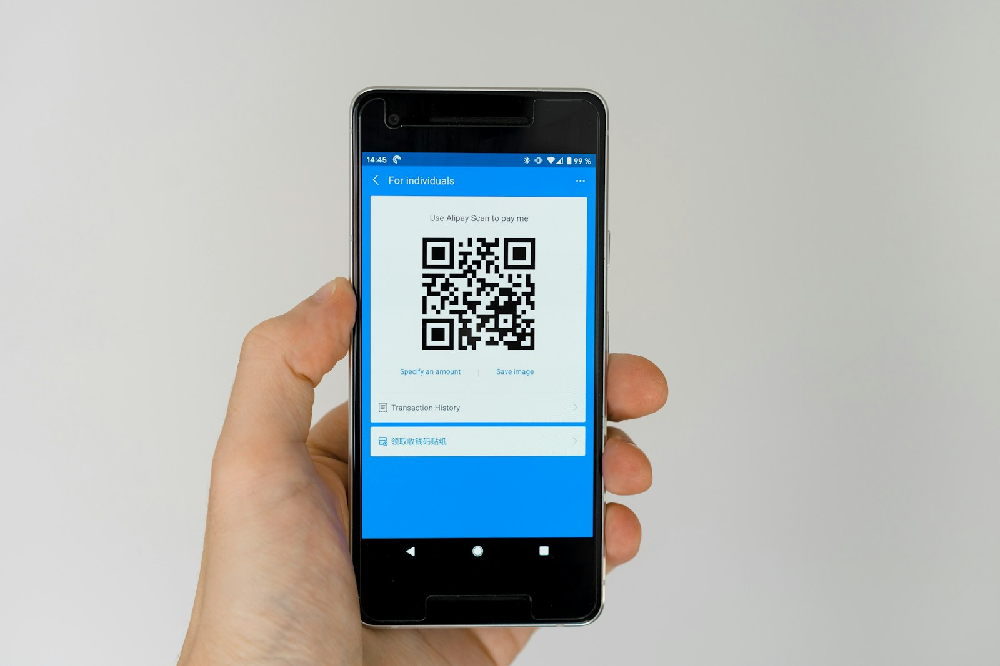

# 稳定币支付架构：技术考量

> [稳定币和C2B支付概览](../Overview-ZH.md)系列的一部分

## 引言

要把稳定币真正用在消费者对企业(C2B)的流程里,就得同时处理好链上技术和线下金融基础设施。下面聊聊企业在落地稳定币支付时绕不开的那些架构选择、核心组件以及实施细节。

先把底层逻辑理清楚,后续的系统设计才会稳、可扩且合规。


*现代稳定币支付系统的技术架构*

---

## 1. 稳定币设计和智能合约

### 法币抵押架构

当今主流稳定币(USDT、USDC、PYUSD等)使用**法币抵押**模型:

**设计原则:**
- 每个代币都由等值法币资产储备支持
- 储备由发行人持有(通常是现金或短期美国国债)
- 1:1赎回保证
- 定期第三方证明/审计
- 透明的储备组成报告[^1]

**智能合约功能:**

基本ERC-20/等效功能:
```solidity
// 核心功能
mint(address to, uint256 amount)      // 发行人创建新代币
burn(address from, uint256 amount)    // 发行人销毁代币
transfer(address to, uint256 amount)  // 用户发送代币
```

**监管合规功能:**
```solidity
// 合规功能
freeze(address account)               // 发行人冻结账户
unfreeze(address account)             // 发行人解冻账户
blacklist(address account)            // 永久封锁账户
```

这些合规功能允许发行人响应:
- 执法请求
- 制裁筛查命中
- 非法活动检测
- 监管命令

### 替代设计(历史背景)

**加密抵押型:**
- 由其他加密货币支持(例如,由ETH支持的DAI)
- 过度抵押以吸收波动性
- 去中心化但资本效率低
- 由于复杂性,支付采用有限

**算法型:**
- 无抵押;依赖供需机制
- 高调失败(2022年Terra/UST崩盘)
- 监管怀疑
- 通常避免用于支付应用[^2][^3]

**行业共识:**
面向支付的稳定币,基本都收敛到**足额储备+透明审计**这条路,才能让用户安心。

---

## 2. 结算层和可扩展性

### 传统区块链挑战

**早期在通用链上部署稳定币面临限制:**

**Ethereum:**
- **优势**: 最去中心化、安全、成熟
- **挑战**: 较高费用(拥堵时每笔交易1-50美元)、较慢确认(每区块12-15秒,置信度需5-10分钟)

**Tron:**
- **优势**: 更快(3秒区块)、更便宜(0.01-0.10美元费用)
- **挑战**: 更中心化、较少开发者工具
- **现实**: 由于低成本,主导亚洲零售USDT转账

### 专用支付网络(2024-2025)

近两年也冒出不少专为支付优化的高性能网络:

**Circle Arc:**
- USDC作为原生gas货币
- 亚秒级确定性最终性
- 内置FX引擎用于多币种
- 企业级可靠性[^4][^5]

**Stripe/Paradigm Tempo:**
- 多稳定币gas支持(USDC、USDT)
- 亚秒级最终性
- 支付特定原语
- 电商规模的高吞吐量[^6][^7]

**Tether Stable/Plasma:**
- Plasma: 零手续费USDT转账
- Stable: 使用StableBFT共识的主要结算
- 基于USDT的费用支付
- 针对零售优化的架构[^8]

**性能比较:**

| 网络 | 最终性 | 吞吐量 | Gas货币 | 每笔交易成本 |
|---------|----------|------------|--------------|-------------|
| Ethereum | 12-15秒 | ~15 TPS | ETH | $1-50 |
| Tron | 3秒 | ~2,000 TPS | TRX | $0.01-0.10 |
| Arc | <1秒 | ~10,000 TPS | USDC | <$0.01 |
| Tempo | <1秒 | ~10,000 TPS | USDC/USDT | <$0.01 |
| Stable/Plasma | <1秒 | ~10,000 TPS | USDT | $0 - $0.001 |

### Layer-2扩展解决方案

**替代方法:** 基于Ethereum构建但使用Layer-2实现可扩展性

**示例:**
- **Coinbase Base**: Optimistic rollup,低成本USDC交易
- **Polygon**: 侧链,高吞吐量,EVM兼容
- **Arbitrum/Optimism**: 具有Ethereum安全性的Optimistic rollup

**优势:**
- 继承Ethereum安全性
- 费用低得多(通常<0.01美元)
- 更快确认
- 现有工具兼容性

**权衡:**
- 额外复杂性(层间桥接)
- 提款延迟(optimistic rollup有7天挑战期)
- 不如Layer-1选项成熟

### 多链策略

许多稳定币跨多个链发行:

**USDC部署:**
- Ethereum
- Solana
- Polygon
- Avalanche
- Arbitrum
- Base
- ...更多

**商家决策:**
支持目标客户最常用的网络。例如:
- **美国/欧洲**: Ethereum、Base、Polygon
- **亚洲零售**: Tron(用于USDT)
- **DeFi用户**: Ethereum、Solana
- **成本敏感**: Layer-2s、Tron、专用支付链

---

## 3. Gas费用和用户体验

### Gas代币问题

传统区块链用户体验摩擦:
1. 用户想向商家支付10 USDC
2. 用户需要USDC(用于支付) + ETH(用于gas费用)
3. 用户必须获取两种不同的代币
4. Gas费用波动不可预测
5. 对非加密原生用户来说复杂

**结果:** 对新手极不友好,自然很难大规模推广。

### 解决方案: Gas抽象

**方法1: 直接用稳定币付Gas**

新的面向支付的区块链原生使用稳定币作为gas:

**Tempo:** 原生接受USDC/USDT作为费用[^9]
- 用户只需要USDC
- 费用以熟悉的美元计价
- 无波动代币暴露

**Arc:** 使用USDC作为gas[^10]
- 可预测的费用预算
- 支付和费用的单一代币
- 简化会计

**Stable/Plasma:** 使用USDT作为费用[^11]
- USDT变体(gasUSDT)用于费用支付
- 标准转账的零费用选项
- 零售友好经济

**方法2: Paymaster / 账户抽象**

**EIP-4337账户抽象:**[^12]
- 智能合约钱包而非EOA(外部拥有账户)
- **Paymaster**合约代表用户赞助gas费用
- 用户签署交易,paymaster支付gas
- Gas费用可从稳定币余额中扣除

**实施:**
```solidity
// 简化的paymaster概念
contract Paymaster {
    function validatePaymasterUserOp(UserOperation calldata userOp)
        external returns (bytes memory context) {
        // 商家或平台赞助gas
        // 用户的USDC余额扣除等值金额
    }
}
```

**好处:**
- 用户仅使用稳定币交易
- 商家或平台补贴gas
- 灵活的费用模型(免费、折扣等)
- 改善入职体验

**示例: Tether Stable**

使用EIP-4337/EIP-7702方案,其中:
- 用户的钱包临时充当智能合约
- 指定的paymaster代表用户用USDT支付gas
- 用户只看到稳定币余额减少
- 幕后是复杂的gas赞助[^13]

---

## 4. 托管和钱包基础设施

### 托管与非托管模型

**托管(托管钱包):**

**工作方式:**
- 服务提供商持有私钥
- 用户余额在内部数据库中跟踪
- 用户之间的转账在链下进行(即时)
- 定期在链上批量结算

**示例:**
- PayPal应用内的PayPal PYUSD
- Circle账户余额
- 交易所钱包(Coinbase、Kraken)

**优势:**
- 同一平台上用户之间的即时转账
- 熟悉的用户体验(如银行应用)
- 用户丢失密码时可恢复账户
- 内部转账无gas费用
- 简化合规(提供商处理)

**权衡:**
- 用户不控制私钥
- 交易对手风险(信任提供商)
- 中心化(违背某些加密优势)

**非托管(自我托管钱包):**

**工作方式:**
- 用户控制私钥
- 所有交易在链上进行
- 钱包软件帮助管理密钥
- 用户负责安全

**示例:**
- MetaMask
- Ledger硬件钱包
- Trust Wallet
- Rainbow

**优势:**
- 真正所有权(不是你的钱包,不是你的币)
- 无交易对手风险
- 抗审查
- 跨服务互操作

**权衡:**
- 用户负责密钥安全
- 丢失密钥=丢失资金(无恢复)
- 每笔交易产生gas费用
- 更复杂的用户体验

### 混合支付架构

**现代支付系统支持两者:**

**Stripe加密支付:**
1. 客户从自我托管钱包支付(链上)
2. Stripe在链上检测支付
3. Stripe立即向商家授信(内部账本)
4. Stripe定期批量结算
5. 商家按偏好接收法币或稳定币

**好处:**
- 用户可以从任何钱包支付
- 商家获得即时授信
- 两全其美

### 商家托管解决方案

**接收稳定币的企业选项:**

**1. 多签自我托管**
- 使用多签名钱包(需要2-of-3或3-of-5签名)
- 用于密钥存储的硬件安全模块(HSM)
- 最适合想要完全控制的企业

**2. 合格托管人**
- 受监管的托管人(Coinbase Custody、Anchorage、BitGo)
- 隔离账户
- 保险覆盖
- 专业安全
- 合规支持

**3. 支付处理器自动转换**
- 接受稳定币,立即转换为法币
- 从不持有加密货币(避免波动风险)
- 处理器处理所有加密操作
- 熟悉的银行结算

**4. Circle账户/托管余额**
- 在Circle账户中持有USDC
- 余额赚取利息
- 向其他Circle用户即时转账
- 直接兑换美元
- 用于资金管理的API集成

**安全考量:**
- **热钱包**: 在线,用于运营需求(更高风险)
- **冷钱包**: 离线,用于长期存储(更低风险)
- **多签名**: 无单点故障
- **保险**: 加密货币持有的犯罪保险
- **审计追踪**: 用于对账的全面日志记录

---

## 5. 与现有系统集成

### 电商平台集成

**目标:** 像信用卡一样无缝接受稳定币。

**架构模式:**

```
┌─────────────┐
│   客户      │
└──────┬──────┘
       │ 用USDC支付
       v
┌────────────────────┐
│ 支付网关            │  (Coinbase Commerce、Stripe、BitPay)
│ - 检测支付          │
│ - 验证金额          │
│ - 处理加密货币      │
└─────────┬──────────┘
          │ Webhook: payment_confirmed
          v
┌───────────────────────┐
│ 电商平台               │  (Shopify、WooCommerce、自定义)
│ - 标记订单已支付       │
│ - 触发配送             │
│ - 生成发票             │
└───────────────────────┘
```

**集成点:**

**1. 结账小部件**
```html
<!-- 示例: Stripe加密结账 -->
<script src="https://js.stripe.com/v3/"></script>
<div id="crypto-payment-element"></div>
<script>
  stripe.createPaymentElement({
    paymentMethods: ['crypto'],
    currency: 'usd',
    amount: 5000 // $50.00
  });
</script>
```

**2. Webhook处理**
```javascript
// 接收支付确认
app.post('/webhooks/crypto-payment', (req, res) => {
  const event = req.body;

  if (event.type === 'payment.confirmed') {
    const orderId = event.metadata.order_id;
    const amount = event.amount; // 稳定币金额
    const txHash = event.transaction_hash;

    // 标记订单为已支付
    updateOrderStatus(orderId, 'paid', {
      amount, txHash, paymentMethod: 'USDC'
    });

    // 触发配送
    fulfillOrder(orderId);
  }

  res.sendStatus(200);
});
```

**3. 对账**
- 支付处理器提供每日对账报告
- 将区块链交易与内部订单匹配
- 会计集成(QuickBooks、Xero等)

### 销售点(POS)集成

**接受稳定币的实体零售:**

**流程:**
1. 客户完成购买
2. 收银员在POS输入金额
3. POS生成二维码(支付请求)
4. 客户用钱包应用扫描
5. 客户确认支付
6. POS在链上检测支付(或通过支付处理器)
7. 打印收据

**技术:**
- 二维码支付请求(BIP-21标准)
- 用于非接触支付的NFC(新兴)
- 即时比特币支付的Lightning Network集成
- 稳定币特定的POS终端

**提供商:**
- BitPay POS
- Flexa(Spedn网络)
- Crypto.com Pay
- 自定义集成

### 银行和资金集成

**将稳定币操作连接到传统银行:**

**入金/出金:**
- **入金**: 转换法币→稳定币
- **出金**: 转换稳定币→法币

**方法:**

**1. 直接发行人赎回**
- Circle: 1:1赎回USDC换取USD(需要Circle账户)
- Paxos: 1:1赎回PYUSD/USDP换取USD
- 最低金额通常为10万-100万美元
- 1-2个工作日结算

**2. 交易所服务**
- Coinbase、Kraken、Gemini: 即时流动性
- 有竞争力的费率
- 较低最低金额(100美元+)
- 即时稳定币↔法币转换
- 银行电汇或ACH提款

**3. 场外交易柜台**
- 用于大额(100万美元+)
- 协商费率
- 自定义结算条款
- 基于关系

**资金管理:**

**自动化策略:**
```
USDC日收入
      ├─→ 转换70%为USD(运营费用)
      ├─→ 保留20%为USDC(未来支付)
      └─→ 投资10%于生息USDC(资金优化)
```

**工具:**
- Circle Account API用于程序化转换
- 资金管理平台(Gnosis Safe、Multis)
- 自动化DeFi收益策略(适当风险管理)

---

## 6. 合规性和结算最终性

### KYC/AML要求

**商家义务:**

**1. 了解您的客户(KYC)**
- 可能需要验证大额交易的客户身份
- 基于阈值的报告(许多司法管辖区为1万美元+)
- 对可疑模式的持续监控

**2. 反洗钱(AML)**
- 根据制裁名单筛查交易
- 监控结构化/拆分模式
- 维护交易记录

**3. 旅行规则合规**
- FATF旅行规则要求交易>1,000美元提供身份信息
- 新兴标准: TRISA、IVMS101
- 去中心化交易的技术挑战

**合规工具:**

**地址筛查:**
- **Chainalysis**: 交易监控、制裁筛查、调查[^18]
- **Elliptic**: 合规和风险管理、DeFi/NFT覆盖
- **TRM Labs**: 专注稳定币合规、跨链分析
- **Crystal**: 地址风险评估

**集成示例:**
```javascript
// 接受支付前筛查地址
const riskScore = await chainalysis.screenAddress(customerAddress);

if (riskScore.risk === 'high') {
  // 拒绝交易或要求额外验证
  return { status: 'rejected', reason: 'high_risk_address' };
}

if (riskScore.sanctioned) {
  // 封锁受制裁地址
  freezeFunds();
  reportToAuthorities();
}
```

### 监管框架

**美国:**

**Genius Act(2025年7月提出):**[^14][^15]
- 稳定币发行人的联邦标准
- 要求: 1:1现金等价物支持
- 定期审计和储备证明
- 州或联邦特许要求
- 消费者保护条款

**欧盟:**

**MiCA(加密资产市场)法规:**
- 涵盖"资产参考代币"和"电子货币代币"
- 发行人的资本和流动性要求
- 持续储备报告
- 消费者赎回权
- 欧盟统一框架

**商家影响:**
- 更清晰的稳定币法律地位
- 减少监管不确定性
- 对业务采用的更高信心
- 标准化合规要求

### 结算最终性

**区块链优势:**

**不可逆结算:**
- 一旦交易获得足够确认,就无法撤销
- 无拒付风险(不像信用卡)
- 无需中介批准的最终结算

**最终性时间:**

| 网络 | 概率最终性 | 经济最终性 |
|---------|----------------------|-------------------|
| Ethereum | ~12秒(1个区块) | ~15分钟(64个区块) |
| Tron | ~3秒(1个区块) | ~1分钟(19个区块) |
| Arc | <1秒(确定性) | <1秒 |
| Tempo | <1秒(确定性) | <1秒 |
| Stable | <1秒(BFT) | <1秒 |

**商家优势:**
- 无拒付欺诈(为许多商家节省0.5-1%的收入)
- 即时结算确定性
- 减少营运资金需求

**商家挑战:**
- 对合法纠纷无拒付保护
- 必须实施自己的纠纷解决
- 如果客户声称未交付则不可逆

**解决方案:**
- 高价值商品的托管智能合约
- 信誉系统
- 销售点欺诈预防
- 加密支付保险产品

### 发行人控制

**冻结/黑名单机制:**

稳定币发行人保留冻结账户的能力:[^16]

**原因:**
- 执法请求
- 制裁合规(OFAC、欧盟制裁名单)
- 智能合约漏洞响应
- 法院命令

**商家影响:**
- 合法企业可能性很低
- 如果客户资金来源非法可能发生
- 需要处理冻结资金的政策
- 保险可能涵盖某些场景

**最近示例:**
PayPal PYUSD事件(2025年): 意外铸造和快速纠正展示了中心化控制机制。[^17]

**权衡:**
- 中心化控制=监管合规
- 去中心化理想=抗审查
- 支付稳定币优先合规

---


*实现跨链稳定币互操作性的多链基础设施*

## 7. 互操作性和跨链架构

### 多链现实

**碎片化挑战:**
- 同一稳定币(例如,USDC)存在于10+条链上
- 客户在Ethereum,商家想要Polygon
- 没有桥接则不可互操作

**解决方案:**

**1. 跨链桥**
- 在链A上锁定代币
- 在链B上铸造等值
- 信任假设各不相同

**示例:**
- Circle的跨链传输协议(CCTP): 原生USDC销毁/铸造
- Layer Zero: 通用消息协议
- Wormhole: 多链桥

**2. 统一稳定币标准**
- USDT0: Tether的跨链标准变体[^18]
- 跨链1:1可交换
- 减少碎片化

**3. 抽象层路由**
- 支付处理器处理跨链复杂性
- 客户在任何链上支付
- 商家在首选链上接收
- 中间件管理桥接

**架构:**
```
客户(Ethereum USDC)
      ↓
支付处理器
      ├─→ 检测: Ethereum支付
      ├─→ 桥接: Ethereum → Polygon(通过CCTP)
      └─→ 结算: 商家接收Polygon USDC
```

### 内置互操作性

**Circle Arc FX引擎:**[^19]
- 原生链上货币兑换
- USDC ↔ EURC ↔ 其他Circle稳定币
- 7x24自动做市
- 无链下中介

**好处:**
- 简化多币种商务
- 即时外汇结算
- 有竞争力的费率
- 原子交换(无结算风险)

---

## 结论: 架构决策框架

实施稳定币支付时,企业必须应对:

**1. 网络选择**
- 目标客户群(地理、技术精通度)
- 成本要求(高量vs.高值)
- 速度要求(即时vs.分钟)
- 安全/去中心化偏好

**2. Gas费用策略**
- 稳定币作为gas网络(Arc、Tempo、Stable)
- Paymaster赞助(补贴客户费用)
- Layer-2低成本选项
- 多网络支持与智能路由

**3. 托管模型**
- 完全自我托管与多签
- 合格托管人
- 支付处理器自动转换
- 混合方法

**4. 集成方法**
- 支付网关(最快、最少控制)
- 直接智能合约集成(最多控制、最复杂)
- 混合: 网关用于用户体验,直接用于资金

**5. 合规框架**
- 地址筛查工具
- KYC/AML程序
- 监管司法管辖区考量
- 审计追踪和报告

**6. 资金管理**
- 自动转换为法币策略
- 运营需求的稳定币保留
- 超额余额的收益优化
- 多币种支持

不存在放之四海而皆准的架构组合,要根据业务需求、风险偏好和用户画像权衡。比较稳妥的做法是先用支付网关这类低门槛方案起步,等交易量和团队能力上来后,再逐步引入直接链上集成、多链路由、资金策略等更精细的模块。

---

## 继续阅读

- [← 上一篇: 主要稳定币举措](./major-stablecoin-initiatives.md)
- [下一篇: 稳定币抽象层 →](./stablecoin-abstraction-layer.md)
- [返回概览](../Overview-ZH.md)

## 相关文章

- [为什么选择稳定币进行C2B支付](./why-stablecoins-for-c2b-payments.md)
- [业务与运营考量](./business-operational-considerations.md)
- [基础设施缺口与路线图](./infrastructure-gaps-roadmap.md)

---

## 参考文献

[^1]: [Stablecoin reserve composition analysis (2025)](https://www.circle.com/en/usdc/transparency)
[^2]: [Terra/UST collapse analysis (2022)](https://www.coindesk.com/learn/the-fall-of-terra-a-timeline-of-the-meteoric-rise-and-crash-of-ust-and-luna)
[^3]: [Regulatory response to algorithmic stablecoins](https://www.coindesk.com/policy/algorithmic-stablecoin-regulation)
[^4]: [Circle Arc Documentation – USDC Gas Mechanism](https://developers.circle.com/arc/docs/usdc-gas)
[^5]: [Arc performance benchmarking](https://developers.circle.com/arc/docs/performance)
[^6]: [Tempo Technical Documentation – Multi-Stablecoin Gas](https://docs.tempo.org/gas-abstraction)
[^7]: [Stripe – Tempo Blockchain Announcement](https://stripe.com/blog/tempo-blockchain-launch)
[^8]: [Tether – Plasma and Stable Architecture](https://tether.io/ecosystem-architecture)
[^9]: [Tempo gas fee implementation details](https://docs.tempo.org/gas-implementation)
[^10]: [Circle Arc – Gas Fee Structure](https://developers.circle.com/arc/docs/fees)
[^11]: [Tether – USDT Gas Implementation](https://tether.io/developers/gas-implementation)
[^12]: [EIP-4337 and EIP-7702 Paymaster Specifications](https://eips.ethereum.org/EIPS/eip-4337)
[^13]: [Tether Stable paymaster implementation](https://tether.io/stable/paymaster)
[^14]: [Nasdaq – U.S. Genius Act Stablecoin Regulation](https://www.nasdaq.com/articles/genius-act-stablecoin-regulation-explained)
[^15]: [Federal stablecoin oversight framework (2025)](https://www.federalreserve.gov/publications/stablecoin-oversight-framework.htm)
[^16]: [USDC Smart Contract – Freeze/Blacklist Functions](https://etherscan.io/address/0xa0b86991c6218b36c1d19d4a2e9eb0ce3606eb48#code)
[^17]: [PayPal PYUSD incident – Mint/burn correction (2025)](https://newsroom.paypal-corp.com/2025-pyusd-incident-response)
[^18]: [Tether – USDT Variants Documentation (USDT0)](https://tether.io/developers/usdt-variants)
[^19]: [Circle Arc – Built-in FX Engine Technical Details](https://developers.circle.com/arc/docs/fx-engine)

---

*Chainsights关于稳定币、支付和C2B商业新闻通讯系列的一部分。*
