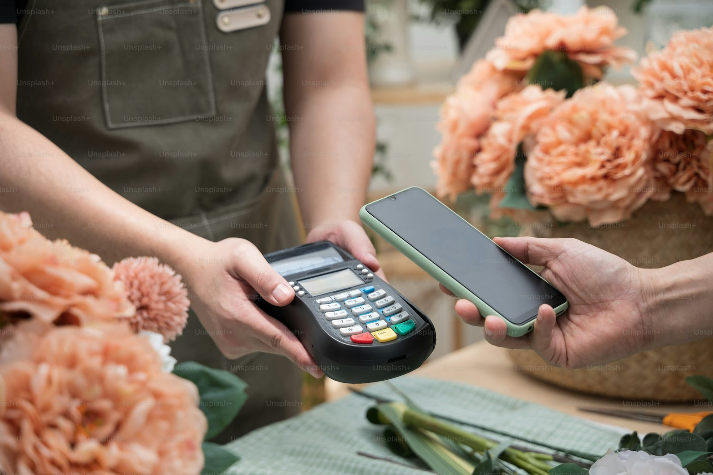

# 为什么选择稳定币用于消费者对企业支付?

> [稳定币与C2B支付概览](../Overview-ZH.md)系列的一部分

## 引言

稳定币的核心很简单:把美元的稳定感和区块链的效率、可编程性放到同一个产品里。随着消费者对企业(C2B)支付逐渐跳出传统卡组织和电汇渠道,这种组合开始显得顺手——它正好对应了全球商务里被抱怨多年的痛点。

接下来的内容,我们按五个优势拆解稳定币为何适合C2B场景,并穿插2023-2025年的真实案例与数据支撑。

*现代数字支付网络实现全球范围内的即时、无边界稳定币交易*

---

## 1. 全球化、即时交易

### 传统支付的问题

传统跨境支付面临重大摩擦:
- 银行电汇需要2-5个工作日才能结算
- 多个中间银行在每一跳都收取费用
- 货币转换以不透明的汇率进行
- 周末和节假日延迟中断业务运营
- 新兴市场的客户获取途径有限

### 稳定币解决方案

稳定币支付通常在几分钟内完成结算(新网络上更快),地理边界基本不起作用。尼日利亚的客户照样可以向美国商家付款,不用等漫长的跨境电汇,资金直接走链上或专门的支付通道。

**真实世界的实施:**

Visa已经用USDC给商家做结算,跨境资金几乎实时到位,不再需要漫长的银行汇款流程。[^1][^2] 对传统支付巨头来说,这算是给稳定币结算投了信任票。

**关键优势:**
- **24/7/365结算**: 无银行营业时间或节假日延迟
- **直接点对点**: 消除中间银行
- **透明跟踪**: 每笔交易都记录在链上
- **可预测时间**: 无论地理位置如何,几分钟内结算

### 使用场景

这使得稳定币非常适合:
- 跨境电子商务
- 国际汇款
- 零工经济向全球承包商支付
- 高交易量商家的实时结算
- 需要立即可用性的紧急支付

---

## 2. 更低的交易费用

### 传统支付的成本

传统支付网络对商家施加了重大成本:
- 信用卡网络每笔交易收取2-3%
- 跨境费用另外增加1-3%
- 货币转换增加2-4%的价差
- 退单每次争议让商家损失15-25美元
- 这些费用无论交易价值如何都是固定的

对于年处理100万美元的商家来说,仅费用就可能意味着2-6万美元的支出。

### 稳定币经济学

换条链上轨道走,稳定币就能绕开大部分中介收费。新一代专为支付设计的网络,目标就是把费用砍到几乎可以忽略。

**真实世界的实施:**

Tether 推出的 Plasma 区块链直接承诺**USDT转账零手续费**,瞄准的就是那些每笔要让出2-3%毛利给卡组织的商家。[^3] 如果发5美元的小额支付不再额外多花1美元,内容打赏、小游戏内购这类场景才真正算得过账。[^4]

**费用对比:**

| 支付方式 | 典型商家费用 | 10美元交易 | 100美元交易 |
|---------|------------|----------|-----------|
| 信用卡 | 2.5% + $0.30 | $0.55 (5.5%) | $2.80 (2.8%) |
| PayPal | 2.9% + $0.30 | $0.59 (5.9%) | $3.20 (3.2%) |
| 银行电汇(国际) | $25-$50固定 | $25 (250%!) | $25 (25%) |
| 稳定币(传统链) | ~$0.10-$2 | $0.10-$2 | $0.10-$2 |
| 稳定币(优化链) | $0.001-$0.01 | $0.001 | $0.001 |

*稳定币支付相比传统支付方式提供显著更低的交易成本*

### 对商业模式的影响

更低的费用解锁了新的可能性:
- **微支付**: 内容付费墙、按文章访问、微捐赠
- **订阅服务**: 较低成本的层级变得有利可图
- **数字商品**: 小额游戏内购买而无高额费用
- **跨境服务**: 在全球范围内竞争而无费用劣势
- **高交易量、低利润**: 杂货店、加油站可以接受数字支付

据报道,亚马逊和沃尔玛等主要零售商正在探索稳定币,特别是为了减少他们每年支付的数十亿美元的卡处理费用。[^5]

---

## 3. 稳定价值:可预测定价

### 加密货币波动性问题

比特币和其他加密货币经历重大价格波动:
- 比特币日波动幅度达10-20%
- 50美元的购买可能在结算时变成40或60美元
- 商家无法一致地为商品定价
- 随着价值波动,会计变得复杂
- 消费者对日常交易的信心较低

### 稳定币设计

像USDC或USDT这样的稳定币通过各种机制维持1.00美元的锚定:
- **法币抵押**: 由美元储备1:1支持(最常见)
- **定期认证**: 第三方审计验证储备
- **赎回机制**: 发行人保证1:1兑换法币
- **高流动性**: 每日数十亿的交易量维持锚定

这么设计的结果是,无论是谁拿着稳定币,50美元的面值基本就能兑付50美元的账单,不会出现突然多出或少掉的金额。

### 业务优势

**简化运营:**
- 以熟悉的美元金额定价产品
- 简单的会计处理(无加密货币波动性会计)
- 可预测的收入确认
- 简单的税务计算和报告
- 消费者对定价有信心

**示例:**
订阅服务可以放心地以每月9.99美元的USDC收费:
- 客户支付恰好9.99美元的等值金额
- 商家收到恰好9.99美元的等值金额
- 会计记录显示9.99美元的收入
- 收费和结算之间没有货币风险

这使得稳定币像"数字现金"而不是投机资产,适合商业用途。

---

## 4. 金融包容性与数字经济准入

### 全球银行业差距

根据世界银行数据:
- 全球仍有14亿成年人没有银行账户
- 25亿人对传统金融服务的获取有限
- 高通胀国家的许多人寻求硬货币替代品
- 跨境支付将数十亿人排除在全球商业之外

### 稳定币作为金融基础设施

稳定币把无银行账户人群、高通胀地区居民进入数字经济的门槛,降到了一个只需手机就能跨过去的高度。

**新兴市场采用:**

在**阿根廷、土耳其和尼日利亚**等市场,许多人已经使用与美元挂钩的稳定币作为安全的价值储存和日常交易:

- **阿根廷**(50%+年通胀率): 公民使用稳定币保持购买力
- **土耳其**(40%+年通胀率): USDT广泛用于储蓄和支付
- **尼日利亚**: 尽管有资本管制,稳定币仍能实现跨境贸易

**使用统计:**

Tether的USDT在全球获得了数亿用户,在新兴市场特别受欢迎,而USDC的使用在美国和欧洲更强。[^6]

**商家的市场机会:**

通过接受稳定币,企业可以:
- **开拓服务不足的市场**: 接触被卡网络排除的客户
- **提供硬货币选项**: 吸引受通胀影响的消费者
- **减少支付摩擦**: 无需银行账户,只需智能手机
- **全球触达**: 一种支付方式在全球通用
- **降低入驻成本**: 无需为每个国家设置商户账户

### 实际示例

接受USDC的数字服务平台可以:
1. 通过一次集成触达100多个国家的客户
2. 通过智能手机加密钱包为无银行账户的用户提供服务
3. 在高通胀地区提供美元计价的定价
4. 避免复杂的多币种商户账户
5. 无论客户位置如何,T+0结算

Stripe与Shopify的合作在34个国家启用USDC支付,体现了这种不断扩大的访问权限。[^7]

---

## 5. 可编程性与智能合约集成

### 超越传统支付轨道

因为稳定币是建立在可编程区块链上的数字代币,所以支付可以通过智能合约实现自动化和编程。这使得传统系统不可能或不切实际的商业模式和支付流成为可能。

### 可编程支付用例

**1. 流支付**
- 按秒付费订阅
- 实时工资支付(每小时而不是双周)
- 按分钟更新的基于使用量的计费
- 按观看秒数收费的内容消费

**2. 托管交易**
- 资金锁定在智能合约中,直到确认交付
- 基于交付证明的自动释放
- 内置合约逻辑的争议解决
- 无需第三方托管服务

**3. 机器对机器(M2M)支付**
- 物联网设备自主互相付款
- AI代理购买API访问或计算资源
- 系统之间的自动化库存补充
- 车辆对车辆充电/停车支付

**4. 条件支付**
- 仅在满足特定条件时释放付款
- 高价值交易的多重签名批准
- 时间锁定支付(归属、计划支付)
- 如果服务SLA未达到则自动退款

**5. 创新计费方案**
- 基于使用量或需求的动态定价
- 多方之间的自动收入分享
- 链上即时分发的忠诚奖励
- 订阅捆绑和跨平台支付

### 真实世界实施: Coinbase x402

Coinbase率先推出了**x402**协议,复兴HTTP的402"需要支付"状态码,用于使用稳定币的无缝微支付。[^8][^9]

**工作原理:**
1. 网络服务或API返回HTTP 402和支付请求
2. 浏览器、应用或AI代理自动用稳定币支付
3. 服务提供请求的资源
4. 整个流程在毫秒内完成,无需用户干预

**用例:**
- 开发人员的按使用量付费API访问
- 高级内容的微支付
- AI代理自主支付服务
- 跨网络的机器可读支付请求

该协议特别预期了AI代理代表用户或其他代理支付服务的时代。[^10]

### 为什么这对C2B支付很重要

传统支付系统设计用于:
- 固定定价
- 定期计费周期
- 人工发起的交易
- 集中处理

稳定币可编程性实现:
- 动态、基于使用量的定价
- 实时结算
- 自动化机器交易
- 去中心化执行

随着数字经济向AI驱动的商业、订阅模式和按需服务发展,可编程稳定币支付提供了支持这些创新的基础设施。

---

## 结论: 数字商务的新范式

把稳定币用在C2B支付上,不是简单把老流程加快一点,而是换了一套玩法:

| 传统支付 | 稳定币支付 |
|---------|----------|
| 2-5天结算 | 几分钟或几秒 |
| 2-5%费用 | 接近零费用 |
| 银行营业时间 | 24/7/365 |
| 地理限制 | 默认全球化 |
| 需要银行账户 | 钱包足够 |
| 固定、定期计费 | 可编程、动态 |
| 退单风险 | 不可逆结算 |

这五个优势的结合——**即时全球交易、大幅降低的费用、稳定价值、金融包容性和可编程性**——使稳定币对下一代消费者对企业支付特别有吸引力。

随着Stripe、PayPal、Circle和Tether等主要平台为稳定币商业建立专用基础设施(在我们的[主要稳定币倡议](./major-stablecoin-initiatives.md)文章中探讨),这些理论优势正在成为全球商家和消费者的实际现实。

---

## 继续阅读

- [← 返回概览](../Overview-ZH.md)
- [下一篇: 主要稳定币倡议(2023-2025) →](./major-stablecoin-initiatives.md)

## 相关文章

- [稳定币支付架构](./stablecoin-payment-architecture.md)
- [业务与运营考虑因素](./business-operational-considerations.md)
- [稳定币抽象层](./stablecoin-abstraction-layer.md)

---

## 参考文献

[^1]: [Visa News – 稳定币结算扩展](https://usa.visa.com/visa-everywhere/blog/bdp/2023/09/05/visa-expands-stablecoin-1693954786588.html)
[^2]: [FXC Intelligence – 跨境支付分析](https://fxcintel.com/research/stablecoins-cross-border-payments)
[^3]: [Tether Plasma公告 – 零费用USDT转账](https://tether.io/news/tether-plasma-blockchain-launch)
[^4]: [使用稳定币的微支付经济学分析](https://www.coindesk.com/tech/2024/micropayments-stablecoins-economics)
[^5]: [报道: 亚马逊和沃尔玛探索稳定币](https://www.reuters.com/technology/retailers-explore-stablecoin-payments-2024)
[^6]: [Nasdaq/Motley Fool – USDC vs Tether及全球使用(3.5亿用户)](https://www.nasdaq.com/articles/usdc-vs-tether-global-stablecoin-adoption-2024)
[^7]: [Stripe新闻室 – Shopify商家通过Stripe接受USDC](https://stripe.com/newsroom/news/shopify-usdc-payments)
[^8]: [Cognitive Revolution播客 – Coinbase的x402微支付协议](https://www.cognitiverevolution.ai/coinbase-x402-protocol)
[^9]: [Coinbase – x402协议文档](https://docs.cloud.coinbase.com/x402/docs)
[^10]: [x402基金会 – AI代理支付用例](https://x402.org/use-cases)

---

*Chainsights通讯系列关于稳定币、支付和C2B商业的一部分。*
